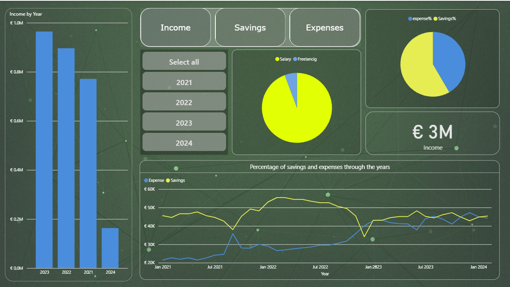
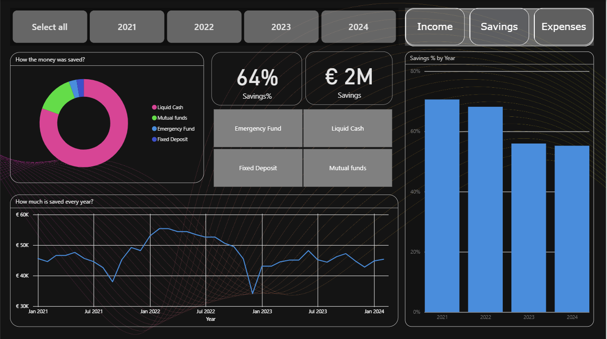
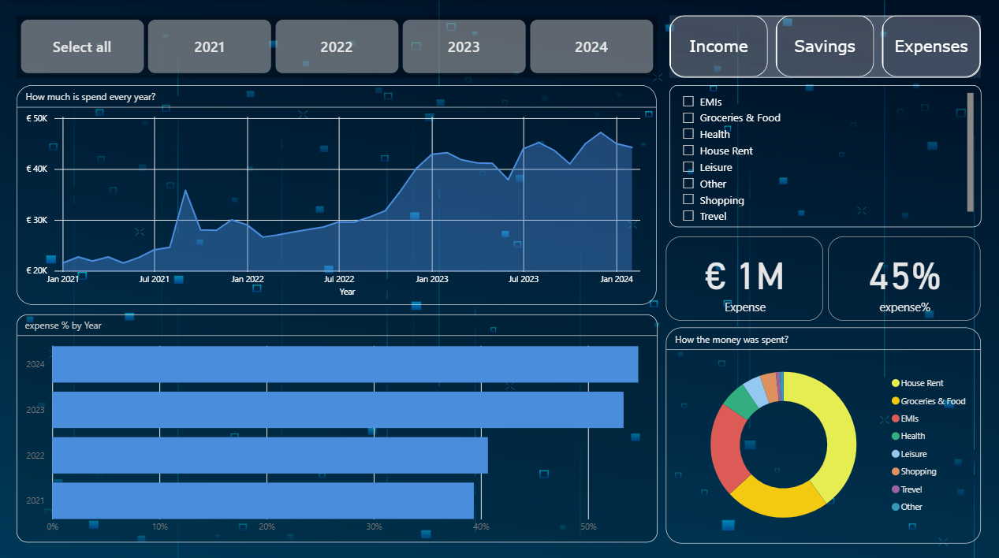

# Personal Finance Dashboard  

This project is a **Personal Finance Dashboard** designed to help you easily track your income and see where it goes — whether into **savings** or **expenses**.  

The dashboard provides:  
- 📊 **Clear visualizations** of your income distribution.  
- 💰 A simple way to monitor how much is being saved versus spent.  
- 📅 An overview of your financial habits over time.  
- 🎯 Insights that can help you make better financial decisions.  

## Screenshots  

  
  
  
